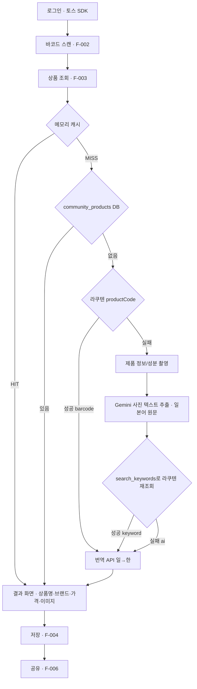

# 삑 (Bbik) — 앱인토스 해외 상품 바코드 스캐너

일본 여행 중 상품 바코드(JAN)를 스캔하면 라쿠텐에서 상품을 조회하고, 번역 API가 한국어로 번역해
보여주는 **앱인토스 미니앱**입니다. 라쿠텐에 없으면 사진을 찍어 Gemini가 정보를 추출하고, 위시리스트로 저장할 수 있습니다.

> 이 문서는 프로젝트에 처음 합류한 사람이 **구조·역할·동작 흐름**을 한 번에 파악하도록 작성했습니다.
> 세부 스펙은 `docs/`, AI 협업 규칙은 `CLAUDE.md`·`.claude/`를 참고하세요.

---

## 1. 한눈에 보기

| 구분 | 내용 |
| --- | --- |
| 플랫폼 | 앱인토스 미니앱 (토스 안에서 실행) |
| 프론트엔드 | React Native + 앱인토스 **Granite** (`@apps-in-toss/framework`, `@toss/tds-react-native`) |
| 백엔드 | **Node.js 프록시 서버** (모든 비즈니스 로직·외부 API 키 보관) |
| DB | Supabase (PostgreSQL) + RLS, 정규화 v2(community_products) |
| 외부 | 라쿠텐 Product Search, Gemini(사진 추출·ai 판단), 번역 API(일→한), 토스 SDK |
| 개발 방식 | Claude Code 하네스 엔지니어링 (`CLAUDE.md` + `.claude/`) |

**절대 원칙**
- 비즈니스 로직·외부 API 키는 **백엔드에만**. 프론트엔드는 화면·호출만.
- 모든 기능 변경은 **코드 + 단위/통합 테스트** 동반(테스트 없는 머지 금지).

---

## 2. 전반적인 동작 흐름 (제품 흐름)



핵심 규칙(요약):
- **조회 폴백 순서**: 메모리 캐시 → community_products(DB) → 라쿠텐 → Gemini. 같은 바코드가 DB에 있으면 외부 호출·Gemini 없이 재사용.
- **lookupType 3값**: `barcode`(라쿠텐 JAN) / `keyword`(사진→추출→재조회) / `ai`(둘 다 실패 후 AI 판단).
- **번역은 번역 API**가 담당, Gemini는 사진 텍스트 추출과 ai 판단만(번역 X).
- 상품 설명/요약 없음 — 상품명(일/한)·브랜드(일/한)·가격·이미지만 표시.

---

## 3. 폴더 구조 + 각 폴더 역할

```
bbik/
├── README.md                  # 이 파일 — 프로젝트 전체 안내
├── CLAUDE.md                  # AI 작업 기억(항상 로드): 아키텍처·도메인규칙·MCP·git·보안
├── .mcp.json                  # MCP 서버 연결: apps-in-toss(ax) + supabase + figma
├── .env.example               # 환경변수 예시(실제 키는 .env에, 커밋 금지)
├── .gitignore                 # .env, *.key, *.pem 등 시크릿 제외
├── commitlint.config.js       # 커밋 메시지 규칙(type + F-ID scope 필수)
│
├── .husky/                    # git 훅(검문소) — 누가 커밋하든 강제
│   ├── commit-msg             #   커밋 메시지 형식 검사(commitlint)
│   └── pre-push               #   push 전 FE/BE 테스트 실행
│
├── .claude/                   # ── AI 하네스 ──
│   ├── settings.json          #   권한·훅(키 차단, main/develop push 차단, push 전 테스트)
│   ├── agents/                #   역할별 서브에이전트(frontend/backend/test/code-reviewer 등)
│   ├── commands/              #   슬래시 커맨드(/implement-feature, /commit, /run-tests ...)
│   └── skills/                #   프로젝트 스킬(스펙확인·라쿠텐·gemini·번역·supabase·git ...)
│
├── docs/                      # ── 문서(스펙·설계·결정) ──
│   ├── context/               #   AI가 참조하는 스펙 원본
│   │   ├── 00-index.md        #     문서 목차 + 공통 전제(v1.1)
│   │   ├── 01-functional-spec.md   #  기능 요구사항(F-001~006·예외)
│   │   ├── 02-business-logic.md     # 비즈니스 로직(BL/BR·의사코드)
│   │   ├── 03-api-spec.md           # API 명세(엔드포인트·응답·에러코드)
│   │   ├── 04-erd.md                # DB 테이블 정의(4테이블·관계도)
│   │   ├── 05-appsintoss-refs.md    # 앱인토스 SDK·테스트·출시·문서 URL
│   │   └── 06-gemini-extraction-spec.md  # Gemini 추출 프롬프트·스키마·저장 매핑
│   ├── adr/                   #   아키텍처 결정 기록(왜 이렇게 정했나)
│   │   ├── 0001-backend-proxy-layer.md   # 백엔드 프록시를 둔 이유
│   │   └── 0002-2step-fallback-lookup.md # 2단계 폴백 조회 결정
│   └── design/                #   디자인(화면 흐름·시안)
│       ├── 00-storyboard.md   #     [Figma] 화면 전환·라우팅 흐름
│       ├── _screen-template.md#     [앱빌더] 화면 설계서 템플릿
│       ├── figma-ref/         #     Figma 스토리보드 캡처
│       └── appbuilder-ref/    #     앱빌더 추출 코드(참조용, RN으로 변환해 사용)
│
├── frontend/                  # ── React Native (Granite) ──
│   ├── app/                   #   파일 기반 라우팅(= 00-storyboard 흐름)
│   │   ├── index.tsx          #     로그인(F-001)
│   │   ├── scan.tsx           #     스캔(F-002)
│   │   ├── capture.tsx        #     촬영 폴백(F-003)
│   │   ├── result/            #     결과(F-003)
│   │   └── saved/             #     저장목록(F-005)
│   ├── src/
│   │   ├── screens/           #   화면 조립(얇게)
│   │   ├── features/          #   기능 단위 흐름·상태 오케스트레이션
│   │   ├── components/        #   TDS-RN 순수 프레젠테이션 컴포넌트
│   │   ├── hooks/             #   상태·사이드이펙트(useScan/useLookup ...)
│   │   ├── api/               #   백엔드 호출 + 에러코드→메시지
│   │   └── lib/               #   순수 유틸(바코드 검증 등)
│   ├── __tests__/             #   단위(unit) / 통합(integration) 테스트
│   ├── ait.config.ts          #   앱인토스 빌드 설정
│   └── package.json
│
└── backend/                   # ── Node.js 프록시(모든 로직·키) ──
    ├── src/
    │   ├── routes/            #   엔드포인트 ↔ controller 연결
    │   ├── controllers/       #   HTTP 입출력만(검증·응답 포맷)
    │   ├── services/          #   비즈니스 로직(BL-001~007)
    │   ├── repositories/      #   Supabase 접근(users/community_products/saved/scan)
    │   ├── clients/           #   외부 API(라쿠텐/gemini/번역/supabase)
    │   ├── middleware/        #   auth/error/validate/ratelimit
    │   ├── cache/             #   바코드 메모리 캐시(키=JAN)
    │   └── config/            #   환경변수(키) 로딩
    ├── tests/                 #   단위(unit) / 통합(integration)
    └── package.json
```

### 백엔드 계층 (단방향)
`Controller → Service → (Repository | Client)`
controller=HTTP만, service=비즈니스 로직/규칙, repository=DB 접근, client=외부 API. 외부 키는 config에만.

### 프론트엔드 계층 (단방향)
`Screen → Feature → Hook → ApiClient → lib`, Component는 말단 프레젠테이션.
외부 API 직접 호출 금지(전부 backend 경유), 카메라/바코드 디코딩은 네이티브(iOS Vision/Android ML Kit).

---

## 4. 앱인토스 셋업 & 실행

```bash
# 도구(머신 1회)
brew tap toss/tap && brew install ax        # 앱인토스 CLI(=MCP 서버)
npm i -g @anthropic-ai/claude-code          # Claude Code

# 환경변수
cp .env.example backend/.env                # 그 다음 라쿠텐/Gemini/번역/Supabase 키 채우기

# 실행
cd backend && npm install && npm run dev    # 백엔드
cd frontend && npm install && npm run dev   # 프론트(Granite)
```

- 콘솔에 미니앱 등록, Origin 허용: 실제 `https://<appName>.apps.tossmini.com` / QR `https://<appName>.private-apps.tossmini.com`.
- 토스 로그인 → tossUserKey 확보 → 백엔드 `/api/auth/toss/login`으로 사용자 식별.
- 출시: 샌드박스 → QR 실제환경 CORS 재검증 → 콘솔 검토 요청 → 출시. (상세: `docs/context/05-appsintoss-refs.md`)

---

## 5. MCP 연결 (AI가 공식 문서·도구 참조)

`.mcp.json`에 등록됨. 인증은 각자 1회.
```bash
# apps-in-toss (ax 설치돼 있으면 자동)
claude mcp add --transport stdio apps-in-toss ax mcp start
# figma (원격, OAuth 1회)
claude plugin install figma@claude-plugins-official  # → /mcp 에서 인증
# 앱인토스 공식 docs-search
/plugin marketplace add toss/apps-in-toss-skills
/plugin install knowledge-skills@apps-in-toss-skills
```

---

## 6. 디자인 → 코드 파이프라인
- **Figma = 화면 전환 흐름**(스토리보드) → `docs/design/00-storyboard.md`.
- **앱빌더 = 개별 화면 설계** → `docs/design/appbuilder-ref/<screen>/code.tsx`(참조용).
- 앱빌더 코드는 WebView 스택이라 그대로 못 씀 → frontend-engineer가 `tds-react-native`로 변환해 `frontend/src`에 작성.

---

## 7. Git 워크플로 (feature → develop → main)
```
feat/F-003-lookup ──PR──▶ develop ──릴리스 PR──▶ main
```
- 기능은 develop에서 분기(`feat/F-003-lookup`), PR은 **develop으로**. main은 릴리스 PR로만.
- **main·develop 직접 push 금지**(settings deny + 권장: GitHub branch protection). force-push 금지.
- 커밋: `<type>(<F-ID>): <요약>` 예) `feat(F-003): 라쿠텐 2단계 폴백 구현`.
- push 전 테스트 통과 필수(husky pre-push). 키·시크릿 커밋 금지.
- AI로 작업 시 `/commit`(점검→테스트→커밋), `/implement-feature F-00X`, `/run-tests` 사용.

---

## 8. 테스트
- 백엔드: 단위(services·BL/BR) + 통합(routes E2E, 외부는 nock 목).
- 프론트: 단위(컴포넌트·훅·유틸) + 통합(MSW로 화면 흐름).
- 외부 API는 항상 목(mock), 실호출 0. 예외코드마다 음성 테스트. 전체 실행 `/run-tests`.

---

## 9. 문서 안내
| 알고 싶은 것 | 보는 곳 |
| --- | --- |
| 기능·예외 | `docs/context/01-functional-spec.md` |
| 처리 로직·규칙 | `docs/context/02-business-logic.md` |
| API 계약 | `docs/context/03-api-spec.md` |
| DB 스키마 | `docs/context/04-erd.md` |
| 앱인토스 연동 | `docs/context/05-appsintoss-refs.md` |
| Gemini 추출 | `docs/context/06-gemini-extraction-spec.md` |
| 설계 결정 배경 | `docs/adr/` |
| 화면 흐름·시안 | `docs/design/` |
| AI 협업 규칙 | `CLAUDE.md`, `.claude/` |