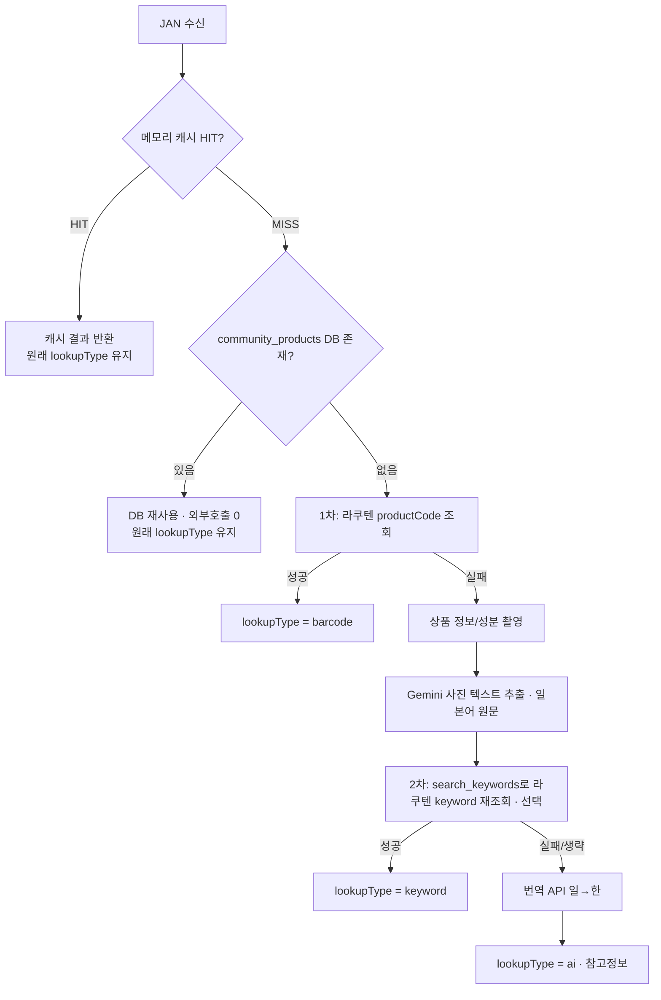

# ADR-0002: 2단계 폴백 상품 조회

> **배치**: `docs/adr/0002-2step-fallback-lookup.md`
> - **상태**: 승인됨 (Accepted) · **일자**: 2026-06-22 (v1.1 반영)
> - **관련**: BL-003, BR-002~005, BR-011

## 1. 폴백 흐름 (그림 = 텍스트)

> ★ v1.1 추가: 캐시 다음에 **community_products(DB) 재사용 단계**가 있다. 같은 바코드를 다른 사용자가
> 이미 등록했으면 외부 호출·Gemini 없이 DB 결과를 재사용한다(공용 마스터). 상세는 `@docs/context/06-gemini-extraction-spec.md`.

## 2. 맥락 (Context)
- 라쿠텐 productCode 조회는 일본 상품이라도 **미등록 바코드가 많다.**
- 그래도 사용자에게 **결과를 보장**해야 한다(P-3 결과 보장).
- 단, 정확도를 위해 **공식 데이터(라쿠텐)를 우선**하고 AI 추론은 최후 수단(P-4 정확도 우선, 환각 최소화).

## 3. 결정 (Decision)
- 조회를 **2단계 폴백**으로 설계한다:
  1. **barcode** — 라쿠텐 productCode(JAN) 조회. 타임아웃 5초(BR-003).
  2. **keyword** — 실패 시 사진 촬영 → Gemini가 상품명·브랜드 추출 → **번역 API**로 일→한 → 그 키워드로 라쿠텐 재조회(BR-004).
  3. **ai** — 재조회도 실패하면 Gemini가 이미지를 직접 판단. **참고 정보**로 표시, 가격 등 미검증은 null(BR-005).
- 출처는 `lookupType`(barcode/keyword/ai)으로 기록(BR-011). 캐시는 출처가 아니므로 원래 값 유지.
- 동일 바코드는 **서버 메모리 캐시** 우선(BR-008)으로 외부 호출·토큰 절약.

## 4. 결과 (Consequences)
**장점**
- 어떤 상품이든 결과가 나옴(빈손 방지) + 정확도 우선(AI는 최후).
- lookupType으로 신뢰도 구분(ai는 참고 정보로 명시).
- 캐시로 라쿠텐 레이트리밋·Gemini 분당 15회 한도 대응.

**감수하는 단점**
- 폴백 단계가 많아 최악의 경우 지연(8~10초 목표 내 단계별 로딩으로 관리).
- ai 결과는 부정확할 수 있어 사용자 고지가 필요.

## 5. 고려했으나 채택하지 않은 대안
- **처음부터 AI로 판단**: 환각·토큰비용 문제로 기각(공식 데이터 우선 원칙).
- **번역까지 Gemini로**: 토큰 절약 위해 번역은 별도 번역 API로 분리(BR-006, 회의 결정).

> 이 결정으로 "왜 바로 AI 안 쓰고 단계를 거치나?" → "정확도 우선·환각 최소화" 근거가 남는다.
