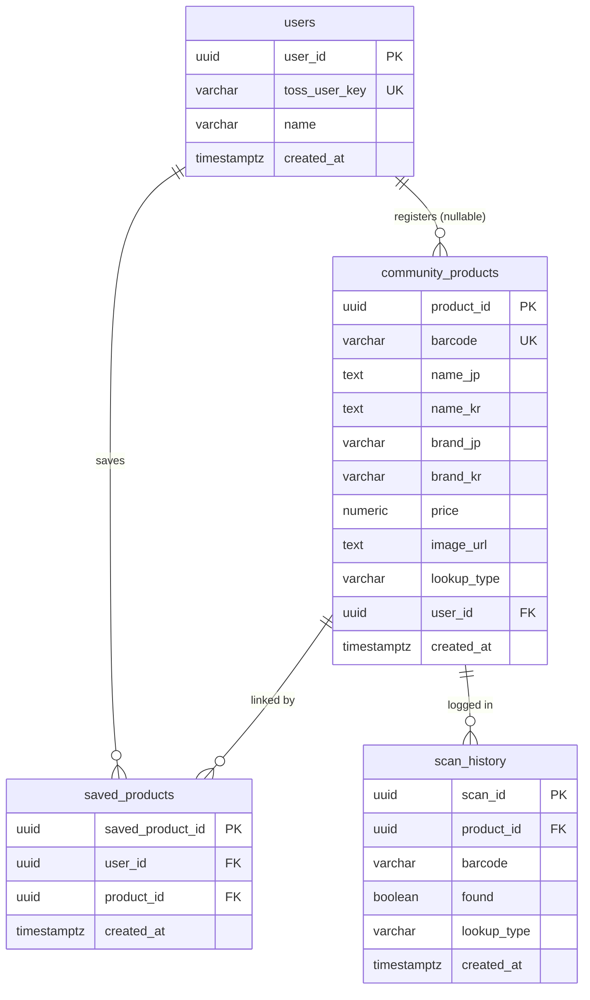

# ERD — 테이블 정의서 v2 (정규화)

| 항목 | 내용 |
| --- | --- |
| DB | Supabase (PostgreSQL) |
| 문서 | 테이블 정의서 v2 (정규화) |
| 비고 | RLS 적용 · 무료 플랜 |

> 상품은 공용 마스터 `community_products`에 1건만(UNIQUE barcode), 사용자 저장은 `saved_products` 연결로 관리.

---

## ■ 관계도

## ■ 테이블 목록

| No | 테이블명 | 논리명 | 설명 |
| --- | --- | --- | --- |
| 1 | users | 사용자 | 서비스 사용자(Toss 로그인) |
| 2 | community_products | 상품 (공용 마스터) | 저장·등록 상품의 중앙 테이블, 전체 공유 |
| 3 | saved_products | 저장 상품(위시리스트) | 사용자 ↔ 상품 연결 (조인 테이블) |
| 4 | scan_history | 스캔 이력 | 바코드/사진 조회 로그 |

## ■ 관계

- `users` (1) : (N) `saved_products` — user_id (필수)
- `community_products` (1) : (N) `saved_products` — product_id (필수)
- `community_products` (1) : (N) `scan_history` — product_id (선택)
- `users` (1) : (N) `community_products` — user_id (선택)

## ■ 코드값 (lookup_type)

- `barcode` : 바코드 조회 (Rakuten 등)
- `keyword` : 키워드(상품명) 검색
- `ai` : AI 이미지 분석 (Gemini)

## ■ 참고

- PK는 엔티티별 이름 사용 (user_id, product_id, saved_product_id, scan_id)
- community_products = 저장/등록된 모든 상품의 중앙 테이블 (라쿠텐 결과 포함)
- saved_products = 사용자↔상품 연결만 보관 (상품 상세는 community_products 참조)
- timestamptz = timestamp with time zone(now()), uuid = gen_random_uuid()
- Null 허용: **X = NOT NULL(필수)**, **O = NULL 허용**

---

## 1. `users` (사용자)

> 서비스 사용자(Toss 로그인 기준)

| No | 컬럼명 | 논리명 | 데이터 타입 | 길이 | Null 허용 | KEY | 기본값 | 설명 |
| --- | --- | --- | --- | --- | --- | --- | --- | --- |
| 1 | user_id | 사용자 ID | uuid | - | X | PK | gen_random_uuid() | 사용자 고유 식별자 |
| 2 | name | 이름 | varchar | 50 | X | - | - | 사용자 이름 |
| 3 | toss_user_key | 토스 사용자키 | varchar | 255 | X | UK | - | Toss 로그인 사용자 식별 키 (고유) |
| 4 | created_at | 생성일시 | timestamptz | - | X | - | now() | 가입/생성 일시 |

**제약조건**
- PK : user_id
- UNIQUE : toss_user_key

---

## 2. `community_products` (상품 / 공용 마스터)

> 저장·등록되는 모든 상품의 중앙 테이블. 바코드 조회/사진/AI로 확보하며 전체 사용자에게 공유

| No | 컬럼명 | 논리명 | 데이터 타입 | 길이 | Null 허용 | KEY | 기본값 | 설명 |
| --- | --- | --- | --- | --- | --- | --- | --- | --- |
| 1 | product_id | 상품 ID | uuid | - | X | PK | gen_random_uuid() | 상품 고유 식별자 |
| 2 | barcode | 바코드 | varchar | 20 | X | UK | - | JAN 바코드 (고유). 조회 키 |
| 3 | name_jp | 상품명(일) | text | - | X | - | - | 일본어 상품명 |
| 4 | name_kr | 상품명(한) | text | - | O | - | - | 한국어 상품명 (번역 결과) |
| 5 | brand_jp | 브랜드(일) | varchar | 100 | O | - | - | 일본어 브랜드명 |
| 6 | brand_kr | 브랜드(한) | varchar | 100 | O | - | - | 한국어 브랜드명 |
| 7 | price | 가격 | numeric | 12,2 | O | - | - | 가격 (엔화, JPY) |
| 8 | image_url | 이미지 URL | text | - | O | - | - | 상품 사진 URL (사진 등록분은 필수) |
| 9 | lookup_type | 출처 유형 | varchar | 20 | X | - | - | 상품 출처: barcode / keyword / ai |
| 10 | user_id | 등록자 ID | uuid | - | O | FK | - | users.user_id 참조. 이 상품을 등록한 사용자(사진/AI). 바코드(라쿠텐)는 NULL |
| 11 | created_at | 생성일시 | timestamptz | - | X | - | now() | 최초 등록 일시 |

**제약조건**
- PK : product_id
- FK : user_id → users.user_id
- UNIQUE : barcode

---

## 3. `saved_products` (저장 상품 / 위시리스트)

> 사용자 ↔ 상품 연결(조인 테이블). 사용자가 저장한 상품 목록

| No | 컬럼명 | 논리명 | 데이터 타입 | 길이 | Null 허용 | KEY | 기본값 | 설명 |
| --- | --- | --- | --- | --- | --- | --- | --- | --- |
| 1 | saved_product_id | 저장 ID | uuid | - | X | PK | gen_random_uuid() | 저장 항목 고유 식별자 |
| 2 | user_id | 사용자 ID | uuid | - | X | FK | - | users.user_id 참조 (저장한 사용자) |
| 3 | product_id | 상품 ID | uuid | - | X | FK | - | community_products.product_id 참조 (저장된 상품) |
| 4 | created_at | 저장일시 | timestamptz | - | X | - | now() | 저장 일시 |

**제약조건**
- PK : saved_product_id
- FK : user_id → users.user_id
- FK : product_id → community_products.product_id
- UNIQUE : (user_id, product_id)

---

## 4. `scan_history` (스캔 이력)

> 바코드/사진 조회 시도 로그

| No | 컬럼명 | 논리명 | 데이터 타입 | 길이 | Null 허용 | KEY | 기본값 | 설명 |
| --- | --- | --- | --- | --- | --- | --- | --- | --- |
| 1 | scan_id | 로그 ID | uuid | - | X | PK | gen_random_uuid() | 스캔 로그 고유 식별자 |
| 2 | product_id | 상품 ID | uuid | - | O | FK | - | community_products.product_id 참조 (조회된 상품). 미발견 시 NULL |
| 3 | barcode | 바코드 | varchar | 20 | O | - | - | 스캔한 바코드 (없으면 NULL) |
| 4 | found | 조회 성공 | boolean | - | X | - | - | 조회 성공 여부 (true/false) |
| 5 | lookup_type | 조회 유형 | varchar | 20 | X | - | - | 조회 경로: barcode / keyword / ai |
| 6 | created_at | 스캔일시 | timestamptz | - | X | - | now() | 스캔 일시 |

**제약조건**
- PK : scan_id
- FK : product_id → community_products.product_id

---

## ■ 구현 주의 (코드 작업 전 확인)

- **캐시는 테이블이 아니다.** 동일 바코드 조회 결과는 서버 **메모리**(키=JAN)에 임시 저장하며,
  서버 재시작 시 초기화된다. 응답에 캐시 여부를 포함하지 않고, 캐시 반환 시 원래 `lookup_type` 유지(BR-008).
- **저장은 2단계**(BL-006): ① `community_products`에 상품 확보(없으면 insert, barcode UNIQUE) →
  ② `saved_products`에 (user_id, product_id) 연결.
- **중복 판정은 (user_id + product_id)** — barcode 아님(BR-009).
- **scan_history는 1스캔=1row.** 폴백(재조회·AI 판단)을 거쳐도 새 row를 만들지 않고
  해당 row를 UPDATE하여 최종 `found`·`lookup_type`을 갱신(P-5).
- 가격은 null=정보 없음, 0=실제 0원으로 구분(BR-010).